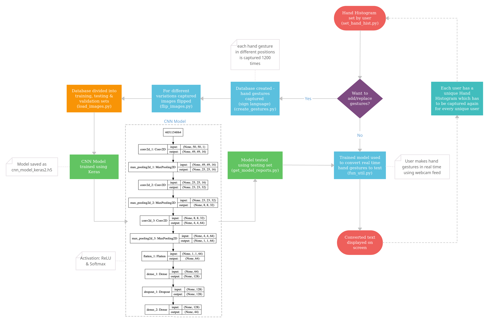
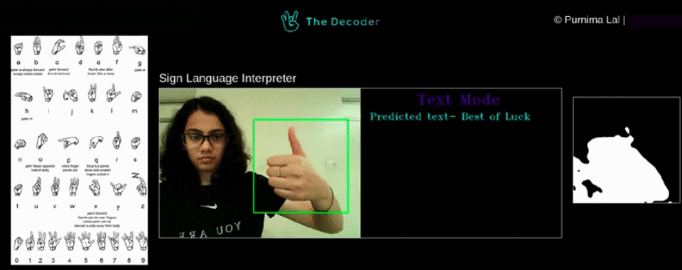
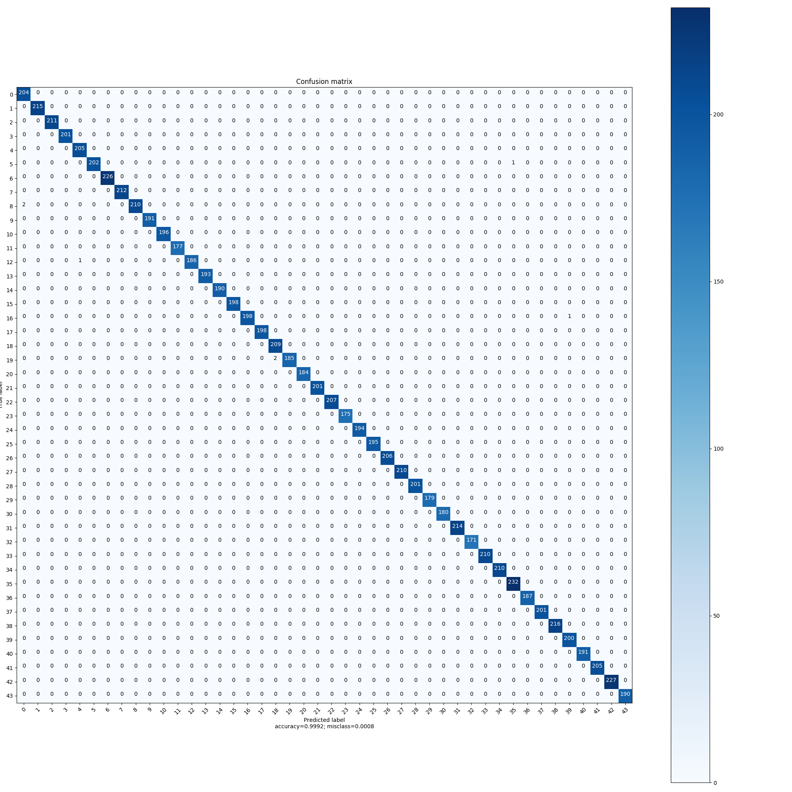
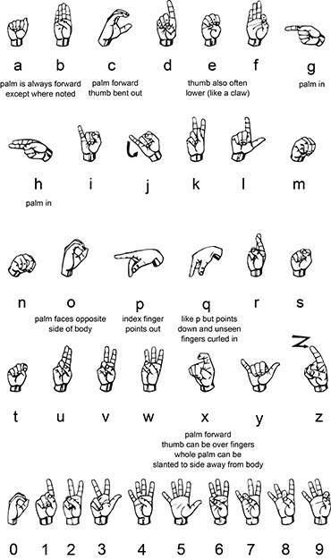

# UCS757 Project - The Sign Language Decoder using Deep Learning

Built CNN model to interpret Sign Language using real time webcam feed.
Web Application developed using Flask.

## Table of contents
* [Behind the Project](#Behind-the-Project)
* [I/O Screenshots](#inputoutput-screenshots)
* [Tools & Technologies Used](#technologies-and-tools)
* [Setup](#setup)
* [How to Use this Repo](#how-to-use-this-repo)
* [Status](#status)

## Behind the Project

1. I created 44 gesture samples using OpenCV. For each gesture I captured 1200 images which were 50x50 pixels. All theses images are in grayscale stored in the gestures/ folder. The pictures were flipped using flip_images.py. This script flips every image along the vertical axis. Hence each gesture has 2400 images.

2. Learnt what a CNN is and how it works. Created a CNN Model.

3. Trained that model using Keras. Tested it out on a live video stream.

The 44 gestures including 26 alphabets, 10 numbers & some other gestures are saved in the gestures folder.

This is a basic overview. 

The methodology flow chart - 

## Input/Output Screenshots

Prediction Accuracy of 0.9992. The confusion matrix - 

## Technologies and Tools
* Python 3.x 
* TensorFlow
* Keras
* OpenCV
* h5py

## Setup

* Use the command prompt to setup a virtual environment.
* Install all dependencies and requirements using the following command - 

`python -m pip install -r requirements.txt`

This will install all libraries required for the project.

## How to Use this Repo 

### Run via the Flask App
* Clone the repo by running - 

    `git clone https://github.com/purnima99/UCS757_SLI.git`

* Run the app.py file - 
    
    `python app.py`

The instructions to use the app-

Step 1 - Click on the <b>'Recognize Hand'</b> button to set you hand histogram & follow the instructions below:
* After clicking the button, a window on the right "Set hand histogram" will appear.
* "Set hand histogram" will have 1 green square.
* Place your hand in that square. Make sure your hand covers the entire square. Hold your hand in that position.
* After 5 seconds, another window "Thresh" will appear where only white patches corresponding to the parts of the image which has your skin color should appear.
* Make sure the square is covered by your hand.
* In case you are not successful then move your hand a little bit again or reload the page. 
* Repeat this until you get a good histogram.
* You will have <b>10 seconds</b> to get a good thresh. After which you move on to <b>Step 2</b>.

Step 2 - A new page will open after Thresh has been set. You can use your hand to make the Sign Language gestures and the corresponding converted text will be displayed. 

Use the gestures provided in the image below - 

Note: You do not need set your hand histogram again if you have already done it. But you do need to do it if the lighting conditions change.

If you have already set your hand, directly click on the <b>'Start Interpreter'</b> button to start Sign Language Conversion.

It is strongly advised to set your hand histogram first for accurate results.

### Running Raw Code via CLI - 

  1. First set your hand histogram. You do not need to do it again if you have already done it. But you do need to do it if the lighting conditions change. To do so type the command given below and follow the instructions below.
    
    python set_hand_hist.py
    
  * A windows "Set hand histogram" will appear.
  * "Set hand histogram" will have 50 squares (5x10).
  * Place your hand in those squares. Make sure your hand covers all the squares.
  * Press 'c'. 1 other window "Thresh" will appear.
  * On pressing 'c' only white patches corresponding to the parts of the image which has your skin color should appear on the "Thresh" window. 
  * Make sure all the squares are covered by your hand.
  * In case you are not successful then move your hand a little bit and press 'c' again. Repeat this until you get a good histogram.
  * After you get a good histogram press 's' to save the histogram. All the windows close.
  
  2. I already have added 44 (0-43) gestures. It is on you if you want to add even more gestures or replace my gestures. Hence this step is <b>OPTIONAL</b>. To create your own gestures or replace my gestures run the following command and pressing 'c' once your hand gesture is ready- 
     
    python create_gestures.py  

  After capturing all the gestures you can flip the images using

    python flip_images.py  

  4. When you are done adding new gestures run `load_images.py` to split all the captured gestures into training, validation and test set. You do not need to run this file again until and unless you add a new gesture.
    
    python load_images.py

  5. To see all the gestures that are stored in 'gestures/' folder run this command
    
    python display_all_gestures.py

  6. Training the model - To train using Keras by running the `cnn_keras.py` file.
  You do not need to retrain your model every time. In case you add or remove a gesture,then you need to retrain it.

  7. Testing the model - For Sign Language recognition start the `recognize_gesture.py` file.You will have a small green box inside which you need to do your gestures.

    python recognize_gesture.py
    
  8. Using the Sign language interpreter - 
  
    python fun_util.py

This will open up the gesture recognition window which will use your webcam to interpret the trained Sign Language gestures. Your hand gestures will be converted to text as shown in the Demo above.

## Status    
Project Status: Completed 
